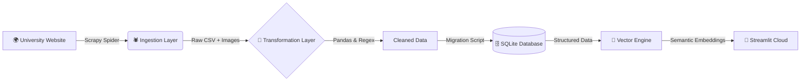

# 🎓 FacultyFinder: AI-Powered Academic Search Engine

**Project 1: The Data Engineering Pipeline & Project 2: Semantic Intelligence Upgrade**

*From Unstructured HTML to a RAG-Ready Knowledge Base*

---

## 🚀 Live Demo

Don't want to install the code? Access the live deployed application here:

👉 **[Click to Open FacultyFinder](https://daiictfacultyfinder.streamlit.app/)**

---

## 📌 Abstract

FacultyFinder is an end-to-end **Data Engineering** solution designed to solve the challenge of accessing unstructured university data. Academic websites often trap critical information—such as research interests, publications, and contact details—inside complex, inconsistent HTML structures, making it inaccessible for analysis or AI applications.

This project automates the **ETL (Extract, Transform, Load)** pipeline that autonomously scrapes, cleans, and structures this data into a relational database. It serves as the foundational "Knowledge Layer" for **Project 2**, enabling advanced AI applications like **Semantic Search** and **RAG (Retrieval-Augmented Generation)**.

---

## 🏗️ System Architecture

The system follows a modular architecture, decoupling the ingestion pipeline from the intelligence layer.

```mermaid
graph LR
    A[🌍 University Website] -->|Scrapy Spider| B(🕷️ Ingestion Layer)
    B -->|Raw CSV + Images| C{🧹 Transformation Layer}
    C -->|Pandas & Regex| D[Cleaned Data]
    D -->|Migration Script| E[(🗄️ SQLite Database)]
    E -->|Structured Data| F[🧠 Vector Engine]
    F -->|Semantic Embeddings| G[🚀 Streamlit Cloud]
```

### Data Flow:

1. **Ingestion**: A custom Scrapy spider crawls the university domain, handling dynamic content and extracting images.

2. **Transformation**: Python scripts clean text, audit quality, and normalize entities (e.g., splitting tags).

3. **Storage**: Data is loaded into a normalized SQLite database.

4. **Vectorization (Project 2)**: Text is embedded into high-dimensional vectors for AI retrieval.

5. **Serving**: A monolithic Streamlit app loads the search index and serves the frontend.

---

## 📊 Data Quality & Statistics

Before migrating data to the production database, a comprehensive audit was performed in the **Transformation Layer** to ensure integrity.

### 1. Dataset Overview

- **Total Profiles Scraped**: 112 Faculty Members
- **Source Coverage**: Regular Faculty, Adjuncts, Distinguished Professors, and Visiting Faculty.

### 2. Missing Data Analysis (The "Visiting Faculty" Gap)

We visualized the dataset using a **Nullity Heatmap** during the cleaning phase to identify patterns in missing information.

| Field            | Availability | Insight                                                                        |
|------------------|--------------|--------------------------------------------------------------------------------|
| Name / Email     | 99%          | High availability; core identity fields are consistent.                        |
| Profile Photo    | 95%          | Successfully recovered via the custom Image Pipeline.                          |
| Biography        | ~63%         | **Significant Gap**: Many Visiting/Adjunct faculty lack full bio pages.        |
| Research Summary | ~13%         | **Critical Gap**: Most profiles do not have a dedicated "Research" text block. |

**Engineering Decision**: This audit confirmed the necessity of our **"Scenario B"** Scrapy logic. Since many visiting faculty do not have full bio pages (causing the 37% gap), our fallback scraper successfully captured their **Specializations (Tags)** from the summary card instead. This ensured we didn't lose critical research data for ~40% of the dataset.

### 3. Normalization Results

By splitting comma-separated strings during the **Transformation** phase, we turned unstructured text into structured insights.

- **Raw Input**: `"AI, Machine Learning, Deep Learning"`
- **Normalized Output**: 3 distinct vectorizable tags.

**Impact**: This enabled the **"Top 5"** magic command feature, allowing the AI to filter results by specific sub-domains rather than just keyword matching.

---

## 🚀 Key Features

### 1. 🕷️ Intelligent Ingestion (Scrapy)

- **Polymorphic Scraping**: Automatically detects if a faculty member has a full profile page ("Scenario A") or just a summary card ("Scenario B") and switches extraction logic instantly.
- **Deep Crawling**: Navigates through 5+ different faculty categories.
- **Image Pipeline**: Extracts and resolves high-resolution faculty profile photos directly from the DOM, with fallback logic for list-view thumbnails.

### 2. 🧹 Data Transformation (Pandas)

- **Audit Trail**: A dedicated script (`notebooks/clean_data.py`) performs automated quality checks and guarantees data health before storage.
- **Sanitization**: Strips HTML artifacts using `w3lib` for clean NLP-ready text.
- **Deadlock Resolution**: Solved Scrapy's "Append Mode" issue by enforcing atomic file overwrites in `settings.py`, guaranteeing fresh data on every run without manual file deletion.

### 3. 🧠 Semantic Search (The Brain)

- **Vector Engine**: Uses `sentence-transformers/all-MiniLM-L6-v2` to convert faculty bios into 384-dimensional vectors.
- **Contextual Matching**: Allows users to search by concept (e.g., "Who works on self-driving cars?") rather than just keywords.

### 4. 🌐 Cloud Deployment

- **Monolithic Deployment**: Hosted on Streamlit Community Cloud for instant accessibility.
- **CI/CD**: Automatic updates via GitHub integration.

---

## 📂 Project Structure
```
FacultyFinder/
│
├── api/                           # Serving Layer (FastAPI / Backend)
│   └── main.py                    # Endpoints & Logic
│
├── daiict_scraper/                # Ingestion Layer (Scrapy)
│   └── daiict_scraper/
│       ├── spiders/
│       │   └── faculty_spider.py  # The Custom Spider
│       └── settings.py            # Pipeline Configuration (Overwrite logic)
│
├── data/                          # Storage Layer
│   ├── raw/                       # Bronze Layer: Raw Scrapy CSVs
│   ├── processed/                 # Silver Layer: Cleaned Data
│   └── faculty.db                 # Gold Layer: SQLite Database
│
├── notebooks/                     # Transformation Layer
│   └── clean_data.py              # Automated Cleaning Script
│
├── src/                           # Engineering Core
│   ├── vector_engine.py           # AI Model Logic
│   └── migrate.py                 # Database Migration Script
│
└── frontend/                      # Presentation Layer
    └── ui.py                      # Streamlit Interface (The App)
```

---

## ⚙️ Installation & Setup

### Prerequisites

- Python 3.9+
- Git

### 1. Clone & Install
```bash
git clone https://github.com/aarsh-adhvaryu/FacultyFinder.git
cd FacultyFinder
python -m venv .venv

# Activate:
# Windows -> .venv\Scripts\activate
# Mac/Linux -> source .venv/bin/activate

pip install -r requirements.txt
```

### 2. Run the Pipeline (The "One-Click" Workflow)

We have optimized the pipeline to run sequentially.

#### **Step A: Ingestion (Scrape Data)**
```bash
cd daiict_scraper
scrapy crawl faculty_spider
cd ..
```

**Output**: `data/raw/faculty_data.csv` (Now includes Images! 📸)

#### **Step B: Transformation (Clean Data)**
```bash
python notebooks/clean_data.py
```

**Output**: `data/processed/cleaned_faculty_data.csv`

#### **Step C: Migration (Load DB)**
```bash
python src/migrate.py
```

**Output**: `data/faculty.db`

#### **Step D: Launch App 🚀**
```bash
streamlit run frontend/ui.py
```

---

## 🔮 Extension to Project 2: The AI Upgrade

FacultyFinder was designed from the ground up to support **Project 2: Semantic Intelligence**.

### The Transition

While **Project 1** focused on **Data Engineering** (getting the data out), **Project 2** focuses on **Data Science & AI** (getting insights from the data).

#### The Problem with Project 1 (SQL)

- User searches "Vision" → Database finds exact word "Vision".
- **Limitation**: It misses "Image Processing" or "Object Detection" because the words are different, even if the meaning is the same.

#### The Solution in Project 2 (Vectors)

We integrated **Sentence Transformers** (`all-MiniLM-L6-v2`) to create a **Vector Space Model**.

**Capabilities**:

- **Semantic Retrieval**: The system understands that "Cybersecurity" and "Network Safety" are related concepts.
- **The 'R' in RAG**: This architecture provides the **Context Retrieval** layer. It is now technically capable of feeding relevant profiles to an LLM (like GPT-4) for question answering, laying the groundwork for a full **Chatbot** application.

### Dynamic Filtering (Magic Commands)

Added **"Magic Commands"** to the UI. For example, typing `top5` in the search bar uses Regex to trigger a strict filtering mode, showing only the 5 highest-confidence matches.

---

## 🤝 Contributing

1. Fork the repository.
2. Create your feature branch (`git checkout -b feature/NewFeature`).
3. Commit your changes (`git commit -m 'Add NewFeature'`).
4. Push to the branch (`git push origin feature/NewFeature`).
5. Open a Pull Request.

---

## 👤 Author

**Aarsh Adhvaryu**  
Data Engineer & AI Researcher  
[GitHub](https://github.com/aarsh-adhvaryu) | [LinkedIn](https://linkedin.com/in/aarsh-adhvaryu-08918234b)

---


## 🙏 Acknowledgments

- **Scrapy** for the robust web scraping framework
- **Sentence Transformers** for semantic embeddings
- **Streamlit** for rapid prototyping and deployment
- **DA-IICT** for the data source

---

**⭐ If you found this project helpful, please consider giving it a star!**