# 🎓 FacultyFinder: End-to-End Data Engineering Pipeline


## 📌 Project Abstract

**FacultyFinder** is a specialized Data Engineering pipeline built to solve the challenge of accessing unstructured university data.

Most university websites lock valuable faculty information (research interests, publications, contact info) inside complex HTML structures, making it inaccessible for analysis or AI applications. This project automates the **extraction, cleaning, normalization, and serving** of this data, transforming raw HTML into a structured API ready for downstream tasks like **RAG (Retrieval-Augmented Generation)** or **Academic Analytics**.

---

## 🏗️ System Architecture

The pipeline follows a standard **ETL (Extract, Transform, Load)** pattern with a decoupled Serving Layer.

```mermaid
graph LR
    A[🌍 DA-IICT Website] -->|Scrapy Spider| B(🕷️ Ingestion Layer)
    B -->|Raw CSV| C{🧹 Transformation Layer}
    C -->|Pandas & Regex| D[Cleaned CSV]
    D -->|Migration Script| E[(🗄️ SQLite Database)]
    E -->|SQL Queries| F[🚀 Serving Layer - FastAPI]
    F -->|JSON Response| G[👨‍💻 Client / AI Model]
```


---

## 🚀 Key Features & Technical Decisions

### 1. Robust Ingestion (Scrapy)

**Why Scrapy?** Unlike BeautifulSoup (which is just a parser), Scrapy is a complete framework that handles asynchronous requests, rate-limiting (to respect server load), and pagination automatically.

**Capabilities:**
- Crawls 5+ different faculty categories (Regular, Adjunct, Distinguished, etc.)
- Handles **"Scenario A vs. Scenario B" logic**: intelligently detects if a faculty member has a full profile page or just a summary card

### 2. Intelligent Transformation (Pandas)

**Auditing:** A dedicated Jupyter Notebook (`Data_cleaning.ipynb`) audits data quality before it touches the database.

**Cleaning:**
- Strips HTML tags using `w3lib`
- Normalizes whitespace and encoding issues
- **Tag Splitting:** Converts comma-separated strings (e.g., "AI, ML, IoT") into individual rows for the relational database

### 3. Relational Storage (SQLite)

**Schema Design:** The database is normalized (3NF) to avoid redundancy.

**Design Decision:** We separated Research Tags into a child table to allow for fast, index-based filtering by interest, rather than slow full-text searches on a single blob column.

### 4. High-Performance Serving (FastAPI)

**Why FastAPI?** It provides automatic schema validation (Pydantic) and auto-generated Swagger documentation.

**Endpoints:**
- `GET /faculty/all` - Full dump for analytics
- `GET /faculty/{id}` - O(1) Lookup for details
- `GET /faculty/search?name=X` - Search functionality

---

## 📊 Database Schema (ER Diagram)

We utilize a **One-to-Many** relationship between Faculty profiles and Research Interests.


---

## 🛠️ Tech Stack

| Component | Tool | Purpose |
|-----------|------|---------|
| **Language** | Python 3.9+ | Core logic and scripting |
| **Ingestion** | Scrapy | Asynchronous web crawling |
| **Processing** | Pandas | Data cleaning and manipulation |
| **Storage** | SQLite3 | Relational persistence |
| **API** | FastAPI / Uvicorn | RESTful API creation and serving |
| **Validation** | Pydantic | Data validation and serialization |

---

## 📂 Project Structure
```text
FacultyFinder/
│
├── api/                       # Serving Layer (FastAPI)
│   └── main.py                # Endpoints & Pydantic Models
│
├── daiict_scraper/            # Ingestion Layer (Scrapy)
│   └── daiict_scraper/
│       ├── spiders/
│       │   └── faculty_spider.py  # The Spider Logic
│       └── items.py           # Data Structure Definitions
│
├── data/                      # Storage Layer
│   ├── raw/                   # Bronze Layer: Raw Scrapy output
│   ├── processed/             # Silver Layer: Cleaned CSVs
│   └── faculty.db             # Gold Layer: Final SQLite Database
│
├── notebooks/                 # Analysis Layer
│   └── Data_cleaning.ipynb    # Logic for HTML stripping & normalizing
│
├── src/                       # Engineering Utilities
│   ├── database.py            # Schema Initialization
│   └── migrate.py             # CSV-to-SQL Migration Script
│
└── requirements.txt           # Dependencies
```

---

## ⚙️ Installation & Setup

### 1. Clone the Repository
```bash
git clone https://github.com/aarsh-adhvaryu/FacultyFinder.git
cd FacultyFinder
```

### 2. Create Virtual Environment
```bash
python -m venv .venv

# Windows
.venv\Scripts\activate

# Mac/Linux
source .venv/bin/activate
```

### 3. Install Dependencies
```bash
pip install -r requirements.txt
```

---

## 🏃 Execution Guide (The Pipeline)

### Step 1: Ingestion

Run the Spider to crawl the live website.
```bash
cd daiict_scraper
scrapy crawl faculty_spider -o ../data/raw/faculty_data.csv
cd ..
```

### Step 2: Transformation

Clean the data using the notebook logic.

1. Open Jupyter: `jupyter notebook`
2. Run `notebooks/Data_cleaning.ipynb`
3. Output: `data/processed/cleaned_faculty_data.csv`

### Step 3: Storage (Migration)

Initialize the DB and load the clean data.
```bash
python src/migrate.py
```

### Step 4: Serving (API)

Launch the API server.
```bash
uvicorn api.main:app --reload --port 8001
```

---

## 📡 API Usage

Once running, the API provides interactive documentation at:

👉 **http://127.0.0.1:8001/docs**

### Example Request (Search)
```http
GET /faculty/search?name=Gupta HTTP/1.1
```

### Example Response
```json
[
  {
    "id": 42,
    "name": "Manish Gupta",
    "designation": "Professor",
    "email": "manish_gupta@daiict.ac.in",
    "research_interests": [
      "Information Retrieval",
      "Data Mining",
      "Machine Learning"
    ]
  }
]
```

### Available Endpoints

| Method | Endpoint | Description | Example |
|--------|----------|-------------|---------|
| `GET` | `/faculty/all` | Retrieve all faculty profiles | N/A |
| `GET` | `/faculty/search` | Search faculty by name | `?name=Gupta` |
| `GET` | `/faculty/{id}` | Get specific faculty by ID | `/faculty/42` |

---

## 🔮 Future Scope

### 1. Vector Embeddings
Convert "Biography" and "Research" text into vector embeddings for semantic search (e.g., searching "Who works on AI?" finds professors who mention "Deep Learning").

### 2. Automated Scheduling
Use GitHub Actions or Airflow to run the scraper weekly to keep data fresh.

### 3. Frontend Dashboard
Build a React/Streamlit dashboard to visualize faculty distribution by research area.

---

## 🤝 Contributing

Contributions are welcome! Please follow these steps:

1. Fork the repository
2. Create a feature branch (`git checkout -b feature/AmazingFeature`)
3. Commit your changes (`git commit -m 'Add some AmazingFeature'`)
4. Push to the branch (`git push origin feature/AmazingFeature`)
5. Open a Pull Request

---

## 📜 License

This project is for educational purposes as part of the Data Engineering curriculum.

---

## 👤 Author

**Aarsh Adhvaryu**

- GitHub: [@aarsh-adhvaryu](https://github.com/aarsh-adhvaryu)
- LinkedIn: [Connect with me](https://www.linkedin.com/in/aarsh-adhvaryu-08918234b)

---

---


---

## 📈 Project Stats


